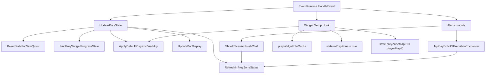
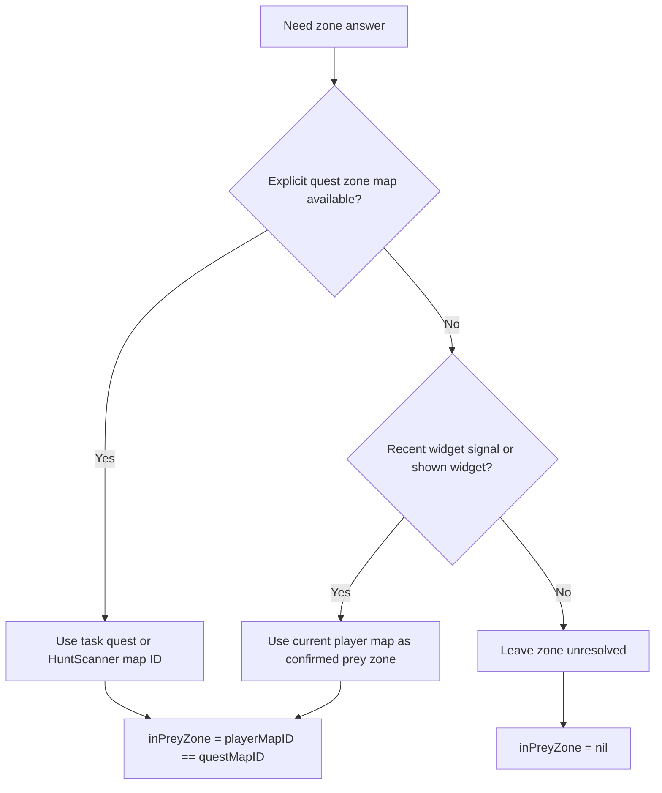
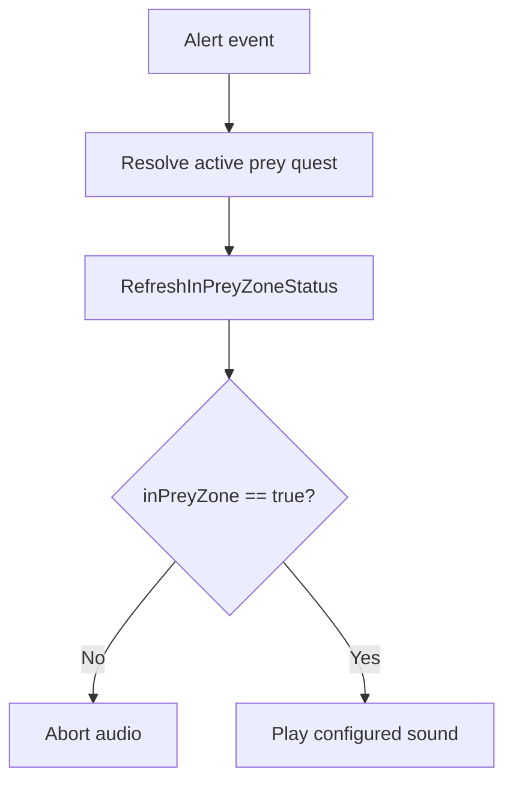
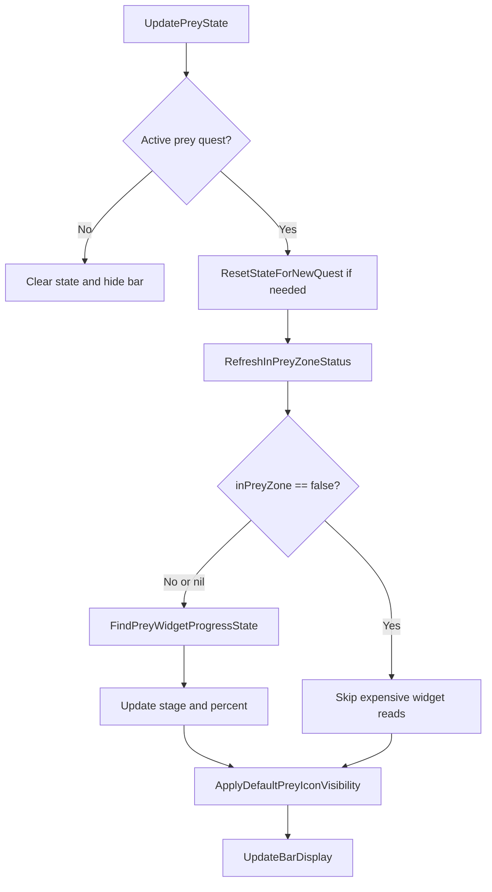
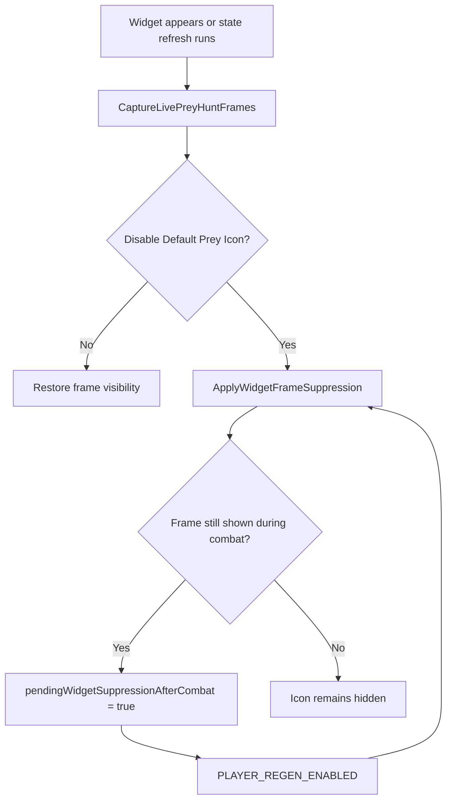
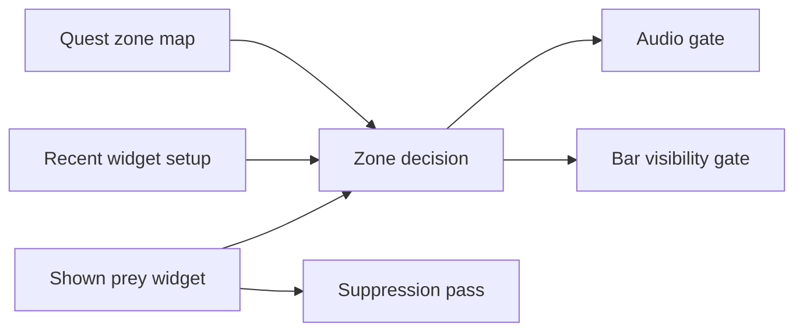
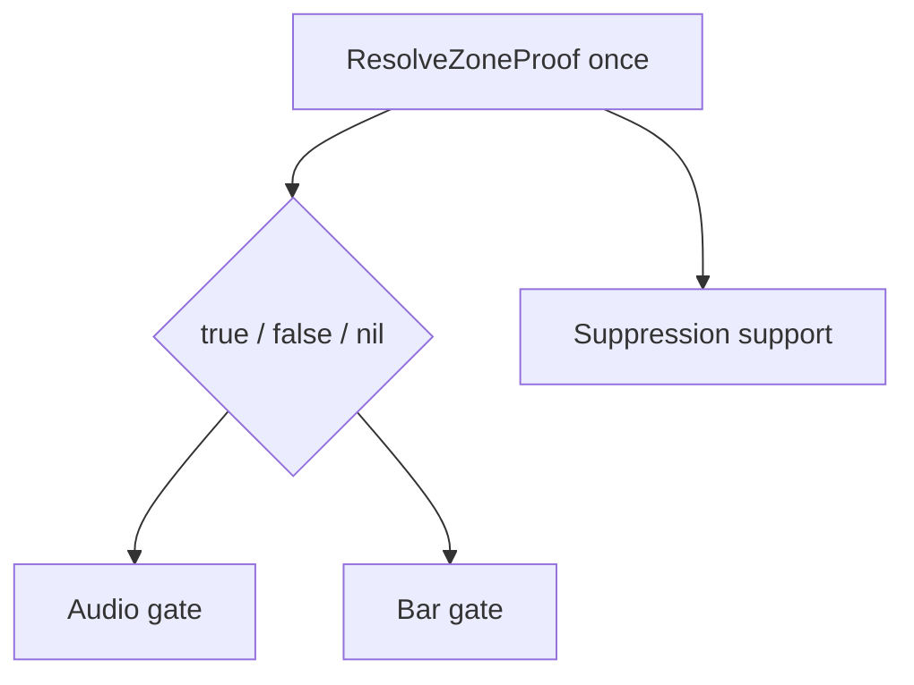

# Preydator Zone Inspection Workflows

This file maps the current zone-related workflows so the failure points are visible without reading the whole addon.

## Purpose

Preydator currently has three closely related but not identical zone-sensitive behaviors:

- Audio gating
- Bar visibility gating
- Blizzard prey widget suppression

The goal of this document is to show where they share logic, where they diverge, and where regressions have been introduced.

## High-Level Runtime Map



## Zone Proof Sources



## Audio Workflow

Audio is the strict path. It refreshes zone state and aborts unless the answer is exactly true.



## Bar Workflow

The bar path is broader because it also owns UI continuity, fallback stage display, alerts, edit mode, and stage-4 carry behavior.



## Suppression Workflow

The default prey icon is hidden by suppressing the Blizzard prey widget frame rather than by changing quest state.



## Shared Decision Points



## Known Regression Points

### 1. Over-broad map fallback

Previous bad path:

```text
quest zone unknown -> QuestLog.GetInfo(...).isOnMap == true -> assume player is in prey zone
```

Why it failed:

- `isOnMap` is broad world-map membership, not a reliable prey-zone match.
- This caused false positives such as Eversong Woods showing a Zul'Aman hunt bar.

### 2. Over-strict zone-entry handling

Previous bad path after removing the broad fallback:

```text
quest zone unknown -> no fresh widget payload yet -> inPreyZone stays nil -> bar blocks
```

Why it failed:

- The Blizzard prey widget itself could already be visible in the correct zone.
- The bar was ignoring that visible widget until a later payload/setup pass happened.

### 3. Suppression timing drift

Failure shape:

```text
widget visible -> suppression does not reclaim control immediately -> user sees Blizzard prey icon
```

Why it failed:

- Suppression timing relied too heavily on deferred retries or later widget refreshes.

## Current Intended Rule Set

The intended rule set after the latest changes is:

1. Prefer an explicit quest-zone map from Blizzard or HuntScanner.
2. If that is unavailable, accept a recent prey widget signal.
3. If that is still unavailable, accept a currently shown prey widget as authoritative in-zone proof.
4. Never use broad `isOnMap` quest-log membership as zone proof.
5. Audio and bar should both rely on the same zone decision, with audio remaining strictly fail-closed.

## Simplification Target

The safest long-term shape is:



That means one shared zone-proof function, fewer independent fallbacks, and less drift between audio and bar behavior.